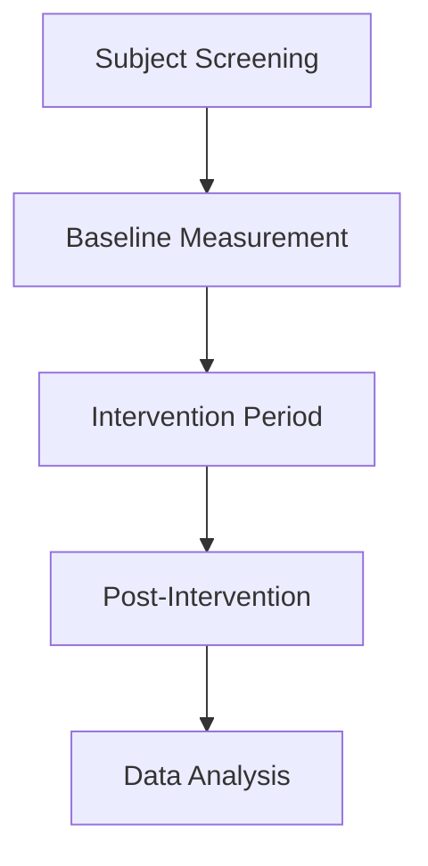

# Clinical Validation Protocol

## Purpose
Establish accuracy and safety of the non-invasive glucose monitoring system through controlled clinical validation.

## Study Design


### Phase 1: Pilot Study (n=10)
- Healthy adults (18-45 years)
- 3 sessions per subject
- Comparison: Fingerstick glucometer

### Phase 2: Clinical Validation (n=50)
| Group | Subjects | Conditions |
|-------|----------|------------|
| A | 20 | Healthy controls |
| B | 15 | Type 1 Diabetes |
| C | 15 | Type 2 Diabetes |

## Validation Metrics
1. **Primary Endpoints:**
   - Mean Absolute Relative Difference (MARD)
   - Clarke Error Grid analysis
   - ISO 15197:2013 compliance

2. **Statistical Analysis:**
   ```python
   # Python accuracy calculation
   def calculate_mard(reference, predicted):
       errors = [abs(r - p) / r * 100 for r,p in zip(reference, predicted)]
       return np.mean(errors)
       
   def clarke_error_grid(reference, predicted):
       # Zone classification code
       return zone_percentages
   ```

## Testing Procedure
### Standard Protocol
1. **Day 1:**
   - HbA1c test
   - Fasting measurements (0 min)
   - Post-breakfast (30, 60, 90, 120 min)

2. **Day 2:**
   - Oral Glucose Tolerance Test (OGTT)
   - Measurements: 0, 30, 60, 90, 120 min

3. **Day 3:**
   - Free-living conditions
   - 8 measurements/day (pre/post meals)

### Comparison Method
- **Reference Device:** Contour Next One glucometer
- **Sampling:**
  - Paired measurements within 15 seconds
  - Same finger (adjacent sites)

## Inclusion Criteria
1. Age 18-70 years
2. BMI 18.5-35 kg/m²
3. Able to provide informed consent
4. For diabetic groups:
   - Diagnosed >6 months
   - Stable medication regime

## Exclusion Criteria
1. Pregnancy
2. Hematocrit <30% or >55%
3. Severe skin conditions
4. Cardiovascular instability
5. Recent blood donation (<8 weeks)

## Data Collection Form
| Parameter | Format | Example |
|-----------|--------|---------|
| Subject ID | Text | S-102 |
| Age | Integer | 42 |
| Gender | M/F/Other | F |
| Diabetes Type | 1/2/None | 2 |
| Medication | Text | Metformin 1000mg |
| Time since last meal | Minutes | 120 |
| Reference glucose | mg/dL | 142 |
| PPG file ID | Text | S102_D1_T60 |

## Statistical Analysis Plan
1. **Sample Size Calculation:**
   ```r
   # R code for power analysis
   power.t.test(
     n = NULL, 
     delta = 15, 
     sd = 20, 
     sig.level = 0.05, 
     power = 0.9,
     type = "paired"
   )
   ```

2. **Analysis Methods:**
   - Bland-Altman plots
   - Linear mixed-effects models
   - ROC analysis for hypo/hyper detection

## Safety Monitoring
1. **Adverse Event Reporting:**
   | Event Type | Reporting Timeframe |
   |------------|---------------------|
   | Skin irritation | Immediate |
   | Device malfunction | 24 hours |
   | Serious events | 1 hour |

2. **Data Safety Monitoring Board:**
   - Independent review every 50 subjects
   - Stopping rules for MARD >20%

## Expected Outcomes
| Metric | Target | Result |
|--------|--------|--------|
| MARD | <15% | TBD |
| Zone A (Clarke) | >95% | TBD |
| Hypoglycemia detection | AUC >0.9 | TBD |
| Time lag | <3 minutes | TBD |

## Ethical Considerations
1. IRB-approved protocol
2. Informed consent in native language
3. Data anonymization
4. Right to withdraw at any time
5. Financial compensation for time

## References
1. ISO 15197:2013 - In vitro diagnostic test systems
2. Clarke WL, et al. (1987) Diabetes Care
3. FDA Guidance - Mobile Medical Applications
